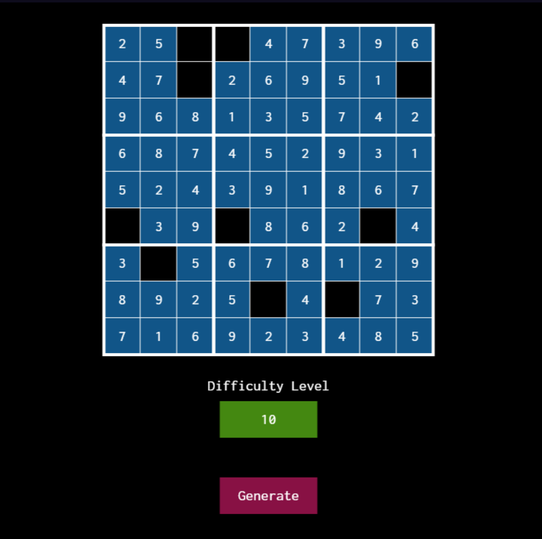

# Sudoku Generator
Generates sudokus based on difficulty. Difficulty level is calculated as the number of space to fill in the puzzle.

# Getting Started
- Open index.html file. 
- Press 'Generate' button to generate new Sudoku Puzzle.
- Press on the Difficulty Level and change it to get new diffulty level. (1 - 65)
